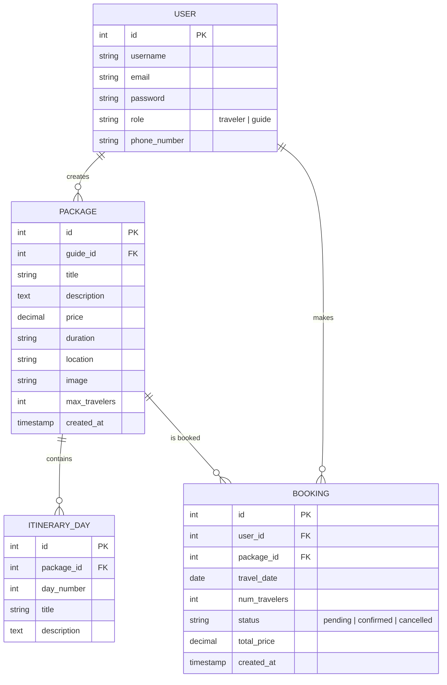
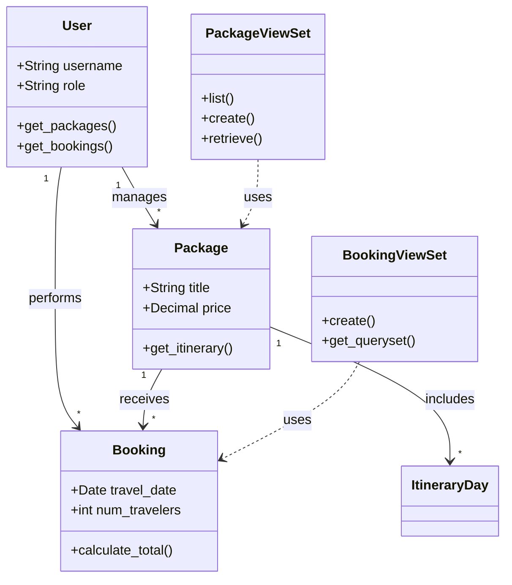
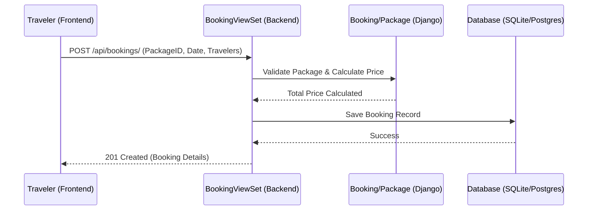
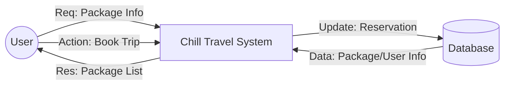
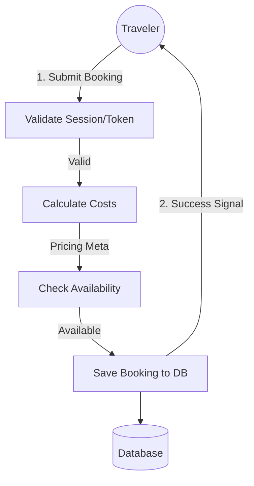

# Chill Travel: System Documentation

This document provides detailed technical documentation for the **Chill Travel** platform, including data modeling and process modeling.

---

## 1. Data Modeling

### A. Conceptual Design
The conceptual model identifies high-level entities and their relationships without technical detail.
- **Entities**: User (Guide, Traveler), Package, Itinerary Day, Booking.
- **Relationships**:
  - A **Guide** creates multiple **Packages**.
  - A **Package** consists of one or more **Itinerary Days**.
  - A **Traveler** makes multiple **Bookings**.
  - A **Booking** links a **Traveler** to a **Package**.

---

### B. Logical Design (ER Diagram)
The Entity-Relationship Diagram (ERD) shows the database structure, fields, and relationships.



---

### C. Physical Design
Detailed database schema definition.

| Table Name | Column | Data Type | Constraints | Description |
| :--- | :--- | :--- | :--- | :--- |
| **users_user** | id | INTEGER | PK, AUTO | Primary Key |
| | username | VARCHAR(150) | UNIQUE, NOT NULL | Login ID |
| | email | VARCHAR(254) | NOT NULL | User Email |
| | role | VARCHAR(10) | NOT NULL | 'traveler' or 'guide' |
| **packages_package** | id | INTEGER | PK, AUTO | Primary Key |
| | guide_id | INTEGER | FK (users_user), NOT NULL | Link to Guide |
| | title | VARCHAR(255) | NOT NULL | Package Name |
| | price | DECIMAL(10,2) | NOT NULL | Base Price |
| **packages_itineraryday**| id | INTEGER | PK, AUTO | Primary Key |
| | package_id | INTEGER | FK (packages_package), NOT NULL | Link to Package |
| | day_number | INTEGER | NOT NULL | Sequence of day |
| **bookings_booking** | id | INTEGER | PK, AUTO | Primary Key |
| | user_id | INTEGER | FK (users_user), NOT NULL | Link to Traveler |
| | package_id | INTEGER | FK (packages_package), NOT NULL | Link to Package |
| | total_price | DECIMAL(10,2) | NOT NULL | Total Cost |

---

## 2. Process Modeling

### A. Object Oriented (UML Diagrams)

#### i. Class Diagram
Focuses on the relationships between Backend components (Models, Serializers, Views).



#### ii. Sequence Diagram (Booking Process)
Describes how objects interact to complete a booking.



#### iii. Component Diagram
Shows the structural organization of the system components.

```mermaid
componentDiagram
    [Client-side (React)] as React
    [Server-side (Django REST Framework)] as DRF
    [Database (Relational)] as DB
    [Cloud Storage (Media/Images)] as Storage

    React --( HTTP/REST : JSON
    DRF --( SQL : Queries
    DRF -- Storage : Uploads
```

---

### B. Structured Modeling (Data Flow Diagrams)

#### i. Data Flow Diagram (Level 1)
Overall data flow between processes and entities.



#### ii. Data Flow Diagram (Level 2 - Booking Process)
Detailed breakdown of the booking process.


